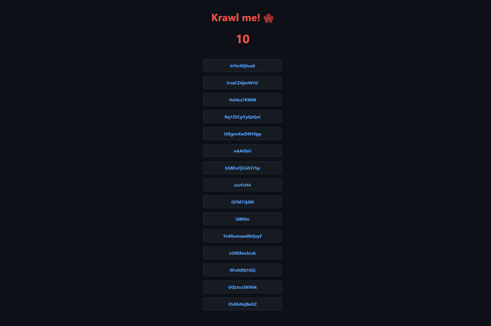
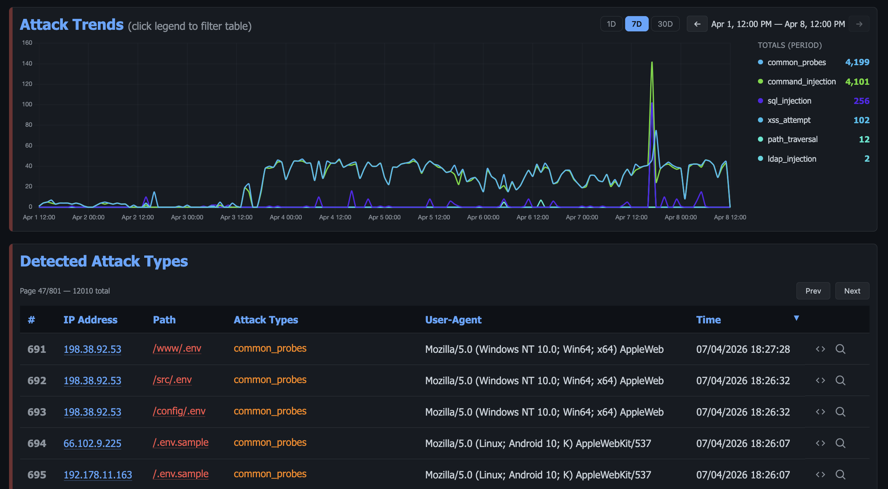
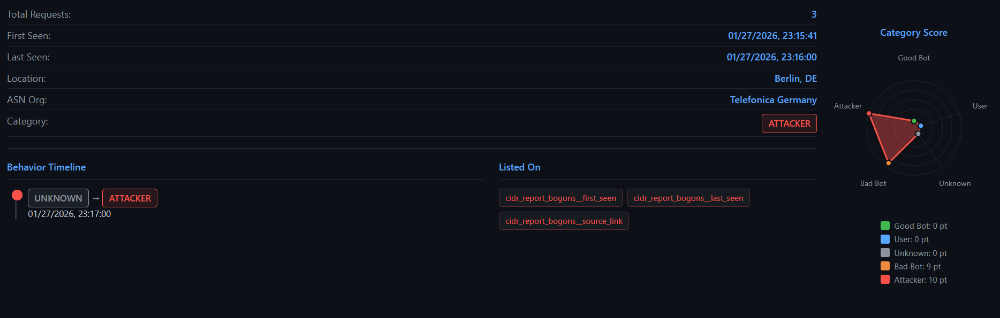

<h1 align="center">Krawl</h1>

<h3 align="center">
  <a name="readme-top"></a>
  
</h3>
<div align="center">

<p align="center">
  A modern, customizable web honeypot server designed to detect and track malicious activity from attackers and web crawlers through deceptive web pages, fake credentials, and canary tokens.
</p>

<div align="center">
  <a href="https://github.com/blessedrebus/krawl/blob/main/LICENSE">
    
  </a>
  <a href="https://github.com/blessedrebus/krawl/releases">
    
  </a>
</div>

<div align="center">
  <a href="https://ghcr.io/blessedrebus/krawl">
    
  </a>
  <a href="https://kubernetes.io/">
    
  </a>
  <a href="https://github.com/BlessedRebuS/Krawl/pkgs/container/krawl-chart">
    
  </a>
</div>
</div>

## Table of Contents
- [Demo](#demo)
- [What is Krawl?](#what-is-krawl)
- [Krawl Dashboard](#krawl-dashboard)
- [Deployment Modes](#deployment-modes)
- [Quickstart](#quickstart)
  - [Docker Run](#docker-run)
  - [Docker Compose](#docker-compose)
  - [Kubernetes](#kubernetes)
  - [Uvicorn (Python)](#uvicorn-python)
- [Configuration](#configuration)
  - [config.yaml](#configuration-via-configyaml)
  - [Environment Variables](#configuration-via-environmental-variables)
- [Ban Malicious IPs](#use-krawl-to-ban-malicious-ips)
- [IP Reputation](#ip-reputation)
- [Forward Server Header](#forward-server-header)
- [Additional Documentation](#additional-documentation)
- [Deception using AI](#ai-generated-deception-pages)
- [Contributing](#contributing)

## Demo
Tip: crawl the `robots.txt` paths for additional fun
### Krawl URL: [http://demo.krawlme.com](http://demo.krawlme.com)
### View the dashboard [http://demo.krawlme.com/das_dashboard](http://demo.krawlme.com/das_dashboard)

## What is Krawl?

**Krawl** is a cloud‑native deception server designed to detect, delay, and analyze malicious attackers, web crawlers and automated scanners.

It creates realistic fake web applications filled with low‑hanging fruit such as admin panels, configuration files, and exposed fake credentials to attract and identify suspicious activity.



By wasting attacker resources, Krawl helps clearly distinguish malicious behavior from legitimate crawlers.

It features:

- **[AI Generated Deception Pages](docs/ai_generation.md)**: **Let attackers help generate your fake vulnerable attack surface**
- **Spider Trap Pages**: Infinite random links to waste crawler resources based on the [spidertrap project](https://github.com/adhdproject/spidertrap)
- **Fake Login Pages**: WordPress, phpMyAdmin, admin panels
- **Honeypot Paths**: Advertised in robots.txt to catch scanners
- **Fake Credentials**: Realistic-looking usernames, passwords, API keys
- **[Canary Token](docs/canary-token.md) Integration**: External alert triggering
- **Random server headers**: Confuse attacks based on server header and version
- **Real-time Dashboard**: Monitor suspicious activity
- **Customizable Wordlists**: Easy JSON-based configuration
- **Random Error Injection**: Mimic real server behavior

You can easily expose Krawl alongside your other services to shield them from web crawlers and malicious users using a reverse proxy. For more details, see the [Reverse Proxy documentation](docs/reverse-proxy.md).


## Krawl Dashboard

Krawl provides a comprehensive dashboard, accessible at a **random secret path** generated at startup or at a **custom path** configured via `KRAWL_DASHBOARD_SECRET_PATH`. This keeps the dashboard hidden from attackers scanning your honeypot.

The dashboard is organized in six tabs:

- **Overview**: high-level view of attack activity: an interactive map of IP origins, recent suspicious requests, and top IPs, User-Agents, and paths.


- **Attacks**: detailed breakdown of captured credentials, honeypot triggers, and detected attack types (SQLi, XSS, path traversal, etc.) with charts and tables.



- **IP Insight**: in-depth forensic view of a selected IP: geolocation, ISP/ASN info, reputation flags, behavioral timeline, attack type distribution, and full access history.


Additionally, after authenticating with the dashboard password, two protected tabs become available:

- **Tracked IPs**: maintain a watchlist of IP addresses you want to monitor over time.
- **IP Banlist**: manage IP bans, view detected attackers, and export the banlist in raw or IPTables format.
- **Deception**: manage AI generated pages, export them or import new ones.

For more details, see the [Dashboard documentation](docs/dashboard.md).

## Deployment Modes

Krawl supports two deployment modes, controlled by the `mode` setting in `config.yaml` or the `KRAWL_MODE` environment variable.

| | Standalone | Scalable |
|---|---|---|
| **Database** | SQLite (WAL mode) | PostgreSQL |
| **Cache** | In-memory Python dict | Redis (multi-tier TTL) |
| **Replicas** | 1 (single instance) | 1+ (horizontal scaling) |
| **External deps** | None | PostgreSQL + Redis |
| **Best for** | Dev, homelabs, <500k requests | Production, HA, >500k requests |

**Standalone** — ideal for development environments or homelabs with low request counts. Zero additional configuration needed, just run Krawl and it works.
- Single container deployment — no external dependencies
- Lower RAM and resource usage

**Scalable** — designed for production environments or high-traffic honeypots. The Helm chart defaults to this mode.
- Faster, more responsive dashboard thanks to Redis multi-tier caching
- Lower disk I/O with Redis acting as a hot-path cache in front of PostgreSQL
- Horizontal scaling — increase the number of Krawl replicas behind a load balancer

For detailed configuration, Docker Compose examples, Kubernetes/Helm setup, and step-by-step migration instructions, see the [Deployment Modes documentation](docs/deployment-modes.md).

## Quickstart

### Docker Run

Run Krawl in standalone mode with the latest image:

```bash
docker run -d \
  -p 5000:5000 \
  -e KRAWL_DASHBOARD_SECRET_PATH="/my-secret-dashboard" \
  -e KRAWL_DASHBOARD_PASSWORD="my-secret-password" \
  -v krawl-data:/app/data \
  --name krawl \
  ghcr.io/blessedrebus/krawl:latest
```

Access the server at `http://localhost:5000`

### Docker Compose

Create a `docker-compose.yaml` with one of the two deployment modes.

**Standalone** — just Krawl server with Sqlite storage:

```yaml
services:
  krawl:
    image: ghcr.io/blessedrebus/krawl:latest
    container_name: krawl-server
    ports:
      - "5000:5000"
    environment:
      - CONFIG_LOCATION=config.yaml
      # - KRAWL_DASHBOARD_PASSWORD=my-secret-password
    volumes:
      - ./config.yaml:/app/config.yaml:ro
      - krawl-data:/app/data
    restart: unless-stopped

volumes:
  krawl-data:
```

**Scalable** — with PostgreSQL and Redis:

> [!CAUTION]
> The example below uses **default passwords** (`krawl`/`krawl`). **Change them before deploying to production.**

```yaml
services:
  postgres:
    image: postgres:16-alpine
    environment:
      POSTGRES_DB: krawl
      POSTGRES_USER: krawl
      POSTGRES_PASSWORD: krawl
    volumes:
      - postgres_data:/var/lib/postgresql/data
    restart: unless-stopped
    healthcheck:
      test: ["CMD-SHELL", "pg_isready -U krawl -d krawl"]
      interval: 10s
      timeout: 5s
      retries: 5

  redis:
    image: redis:7-alpine
    volumes:
      - redis_data:/data
    restart: unless-stopped
    healthcheck:
      test: ["CMD", "redis-cli", "ping"]
      interval: 10s
      timeout: 5s
      retries: 5

  krawl:
    image: ghcr.io/blessedrebus/krawl:latest
    container_name: krawl-server
    ports:
      - "5000:5000"
    environment:
      - CONFIG_LOCATION=config.yaml
      - KRAWL_MODE=scalable
      - KRAWL_POSTGRES_HOST=postgres
      - KRAWL_POSTGRES_PORT=5432
      - KRAWL_POSTGRES_USER=krawl
      - KRAWL_POSTGRES_PASSWORD=krawl
      - KRAWL_POSTGRES_DATABASE=krawl
      - KRAWL_REDIS_HOST=redis
      - KRAWL_REDIS_PORT=6379
      # - KRAWL_DASHBOARD_PASSWORD=my-secret-password
    volumes:
      - ./config.yaml:/app/config.yaml:ro
    restart: unless-stopped
    depends_on:
      postgres:
        condition: service_healthy
      redis:
        condition: service_healthy

volumes:
  postgres_data:
  redis_data:
```

To deploy, just run
```bash
docker compose up -d
```

Production-ready compose files are also available in the [`docker/`](docker/) directory. For **development** (builds from source with hot-reload), use the compose files at the project root.

For more details on both modes, see [Deployment Modes](docs/deployment-modes.md).

### Kubernetes
**Krawl is also available natively on Kubernetes**. Installation can be done either [via manifest](kubernetes/README.md) or [using the Helm chart](helm/README.md).

The Helm chart **defaults to scalable mode** with bundled PostgreSQL and Redis:

```bash
helm install krawl oci://ghcr.io/blessedrebus/krawl-chart --version 2.1.0 \
  -n krawl-system --create-namespace \
  --set postgres.password=your-password \
  --set redis.password=your-redis-password \
  --set dashboardPassword=your-dashboard-password \
  --set config.dashboard.secret_path=/my-secret-dashboard
```

Minimal example values files are provided for both modes:
- [`values-minimal.yaml`](helm/values-minimal.yaml) — Scalable (default)
- [`values-standalone.yaml`](helm/values-standalone.yaml) — Standalone

See [Deployment Modes](docs/deployment-modes.md) and [Chart documentation](helm/README.md) for full configuration and migration instructions.

### Uvicorn (Python)

Run Krawl directly with Python 3.13+ and uvicorn for local development or testing:

```bash
pip install -r requirements.txt
uvicorn app:app --host 0.0.0.0 --port 5000 --app-dir src
```

Access the server at `http://localhost:5000`


## Configuration
Krawl uses a **configuration hierarchy** in which **environment variables take precedence over the configuration file**. This approach is recommended for Docker deployments and quick out-of-the-box customization.

### Configuration via config.yaml
You can use the [config.yaml](config.yaml) file for advanced configurations, such as Docker Compose or Helm chart deployments.

### Configuration via Environmental Variables

| Environment Variable | Description | Default |
|----------------------|-------------|---------|
| `CONFIG_LOCATION` | Path to yaml config file | `config.yaml` |
| `KRAWL_PORT` | Server listening port | `5000` |
| `KRAWL_DELAY` | Response delay in milliseconds | `100` |
| `KRAWL_SERVER_HEADER` | HTTP Server header for deception | `""` |
| `KRAWL_LINKS_LENGTH_RANGE` | Link length range as `min,max` | `5,15` |
| `KRAWL_LINKS_PER_PAGE_RANGE` | Links per page as `min,max` | `10,15` |
| `KRAWL_CHAR_SPACE` | Characters used for link generation | `abcdefgh...` |
| `KRAWL_MAX_COUNTER` | Initial counter value | `10` |
| `KRAWL_CANARY_TOKEN_URL` | External canary token URL | None |
| `KRAWL_CANARY_TOKEN_TRIES` | Requests before showing canary token | `10` |
| `KRAWL_DASHBOARD_SECRET_PATH` | Custom dashboard path | Auto-generated |
| `KRAWL_DASHBOARD_PASSWORD` | Password for protected dashboard panels | Auto-generated |
| `KRAWL_DASHBOARD_CACHE_WARMUP` | Pre-compute dashboard data every 5 minutes for instant page loads | `true` |
| `KRAWL_DASHBOARD_WARMUP_PAGES` | Number of pages to pre-warm per table panel | `10` |
| `KRAWL_DASHBOARD_WARMUP_AGGREGATION` | Pre-compute full top_paths/top_ua aggregations for zero-query serving | `false` |
| `KRAWL_DASHBOARD_TOP_N_MIN_COUNT` | Minimum access count for top paths/user agents panels (set to 1 to disable) | `5` |
| `KRAWL_PROBABILITY_ERROR_CODES` | Error response probability (0-100%) | `0` |
| `KRAWL_DATABASE_PATH` | Database file location | `data/krawl.db` |
| `KRAWL_DATABASE_PERSIST_SUSPICIOUS_ONLY` | Only persist suspicious requests to the access log | `false` |
| `KRAWL_BACKUPS_PATH` | Path where database dump are saved | `backups` |
| `KRAWL_BACKUPS_CRON` | cron expression to control backup job schedule | `*/30 * * * *` |
| `KRAWL_BACKUPS_ENABLED` | Boolean to enable db dump job | `true` |
| `KRAWL_DATABASE_RETENTION_DAYS` | Days to retain data in database | `30` |
| `KRAWL_TARPIT_ENABLED` | Trap AI agents with slow responses and random text | `false` |
| `KRAWL_TARPIT_DELAY_SECONDS` | Extra delay in seconds added per response when tarpit is active | `5` |
| `KRAWL_HTTP_RISKY_METHODS_THRESHOLD` | Threshold for risky HTTP methods detection | `0.1` |
| `KRAWL_VIOLATED_ROBOTS_THRESHOLD` | Threshold for robots.txt violations | `0.1` |
| `KRAWL_UNEVEN_REQUEST_TIMING_THRESHOLD` | Coefficient of variation threshold for timing | `0.5` |
| `KRAWL_UNEVEN_REQUEST_TIMING_TIME_WINDOW_SECONDS` | Time window for request timing analysis in seconds | `300` |
| `KRAWL_USER_AGENTS_USED_THRESHOLD` | Threshold for detecting multiple user agents | `2` |
| `KRAWL_ATTACK_URLS_THRESHOLD` | Threshold for attack URL detection | `1` |
| `KRAWL_INFINITE_PAGES_FOR_MALICIOUS` | Serve infinite pages to malicious IPs | `true` |
| `KRAWL_MAX_PAGES_LIMIT` | Maximum page limit for crawlers | `250` |
| `KRAWL_BAN_DURATION_SECONDS` | Ban duration in seconds for rate-limited IPs | `600` |
| `KRAWL_AI_ENABLED` | Enable AI-generated deception pages | `false` |
| `KRAWL_AI_PROVIDER` | AI provider (`"openrouter"` or `"openai"`) | `"openrouter"` |
| `KRAWL_AI_OPENAI_BASE_URL` | Optional OpenAI Base URL for custom API endpoints | `"https://api.openai.com/v1"` |
| `KRAWL_AI_API_KEY` | API key for AI provider | `None` |
| `KRAWL_AI_MODEL` | AI model to use for page generation | `"nvidia/nemotron-3-super-120b-a12b:free"` |
| `KRAWL_AI_TIMEOUT` | Request timeout in seconds for AI API calls | `60` |
| `KRAWL_AI_MAX_DAILY_REQUESTS` | Max number of AI-generated pages per day (0 = unlimited) | `0` |
| `KRAWL_AI_PROMPT` | Custom prompt template for AI page generation | Default prompt |
| **Scalable mode** | | |
| `KRAWL_MODE` | Deployment mode (`standalone` or `scalable`) | `standalone` |
| `KRAWL_POSTGRES_HOST` | PostgreSQL hostname | `localhost` |
| `KRAWL_POSTGRES_PORT` | PostgreSQL port | `5432` |
| `KRAWL_POSTGRES_USER` | PostgreSQL username | `krawl` |
| `KRAWL_POSTGRES_PASSWORD` | PostgreSQL password | `krawl` |
| `KRAWL_POSTGRES_DATABASE` | PostgreSQL database name | `krawl` |
| `KRAWL_REDIS_HOST` | Redis hostname | `localhost` |
| `KRAWL_REDIS_PORT` | Redis port | `6379` |
| `KRAWL_REDIS_DB` | Redis database number | `0` |
| `KRAWL_REDIS_PASSWORD` | Redis password | None |
| `KRAWL_REDIS_CACHE_TTL` | TTL in seconds for dashboard warmup data | `600` |
| `KRAWL_REDIS_HOT_TTL` | TTL in seconds for hot-path data (ban info, IP categories) | `30` |
| `KRAWL_REDIS_TABLE_TTL` | TTL in seconds for paginated dashboard tables | `120` |

For example

```bash
# Set canary token
export CONFIG_LOCATION="config.yaml"
export KRAWL_CANARY_TOKEN_URL="http://your-canary-token-url"

# Set number of pages range (min,max format)
export KRAWL_LINKS_PER_PAGE_RANGE="5,25"

# Set analyzer thresholds
export KRAWL_HTTP_RISKY_METHODS_THRESHOLD="0.2"
export KRAWL_VIOLATED_ROBOTS_THRESHOLD="0.15"

# Set custom dashboard path and password
export KRAWL_DASHBOARD_SECRET_PATH="/my-secret-dashboard"
export KRAWL_DASHBOARD_PASSWORD="my-secret-password"
```

Example of a Docker run with env variables (standalone mode):

```bash
docker run -d \
  -p 5000:5000 \
  -e KRAWL_MODE=standalone \
  -e KRAWL_PORT=5000 \
  -e KRAWL_DELAY=100 \
  -e KRAWL_DASHBOARD_PASSWORD="my-secret-password" \
  -e KRAWL_CANARY_TOKEN_URL="http://your-canary-token-url" \
  --name krawl \
  ghcr.io/blessedrebus/krawl:latest
```

## Use Krawl to Ban Malicious IPs
Krawl uses a reputation-based system to classify attacker IP addresses and provides two ways to export IP lists for firewall integration.

The `/api/export-ips` endpoint queries the database directly and supports filtering by IP category (`attacker`, `bad_crawler`, `regular_user`, `good_crawler`) and output format (`raw`, `iptables`, `nftables`):

```bash
curl "https://your-krawl-instance/<DASHBOARD-PATH>/api/export-ips?categories=attacker&fwtype=raw"
```

This enables automatic blocking of malicious traffic across various platforms:
* [OPNsense and pfSense](https://ipv64.net/v64_blocklist_integration_guide)
* [RouterOS](https://rentry.co/krawl-routeros)
* [IPtables](plugins/iptables/README.md) and [Nftables](plugins/nftables/README.md)
* [Fail2Ban](plugins/fail2ban/README.md)

For full API parameters, examples, and adding custom firewall formats, see the [Firewall Exporters documentation](docs/firewall-exporters.md).

## IP Reputation
Krawl [uses tasks that analyze recent traffic to build and continuously update an IP reputation](src/tasks/analyze_ips.py) score. It runs periodically and evaluates each active IP address based on multiple behavioral indicators to classify it as an attacker, crawler, or regular user. Thresholds are fully customizable.



The analysis includes:
- **Risky HTTP methods usage** (e.g. POST, PUT, DELETE ratios)
- **Robots.txt violations**
- **Request timing anomalies** (bursty or irregular patterns)
- **User-Agent consistency**
- **Attack URL detection** (e.g. SQL injection, XSS patterns)

Each signal contributes to a weighted scoring model that assigns a reputation category:
- `attacker`
- `bad_crawler`
- `good_crawler`
- `regular_user`
- `unknown` (for insufficient data)

The resulting scores and metrics are stored in the database and used by Krawl to drive dashboards, reputation tracking, and automated mitigation actions such as IP banning or firewall integration.

## AI-Generated Deception Pages

Krawl can automatically generate realistic deception pages using AI models from **OpenRouter** or **OpenAI** APIs. This feature creates unique, plausible honeypot pages on-the-fly to deceive attackers without manual page creation.

**Key Features:**
- **Dynamic Generation**: Creates unique HTML pages for any request path
- **Smart Caching**: Caches generated pages to avoid redundant API calls
- **Daily Rate Limiting**: Control API costs with configurable request limits
- **Multiple Providers**: Support for OpenRouter (free options) and OpenAI
- **Graceful Fallback**: Falls back to standard honeypot when disabled or limit reached
- **Cached Serving**: Previously generated pages served even when AI is disabled

**Quick Setup:**

```yaml
ai:
  enabled: true
  provider: "openrouter"
  openai_base_url: "your-custom-base-url"
  api_key: "your-api-key"
  model: "nvidia/nemotron-3-super-120b-a12b:free"
  timeout: 60
  max_daily_requests: 10
```

For detailed configuration and usage, see the [AI Generation documentation](docs/ai_generation.md).

## Forward server header
If Krawl is deployed behind a proxy such as NGINX the **server header** should be forwarded using the following configuration in your proxy:

```bash
location / {
    proxy_pass https://your-krawl-instance;
    proxy_pass_header Server;
}
```

## Additional Documentation

| Topic | Description |
|-------|-------------|
| [AI Generation](docs/ai_generation.md) | Configure AI-generated deception pages using OpenRouter or OpenAI |
| [Deployment Modes](docs/deployment-modes.md) | Standalone (SQLite) vs Scalable (PostgreSQL + Redis) mode, configuration, and data migration |
| [Honeypot](docs/honeypot.md) | Full overview of honeypot pages: fake logins, directory listings, credential files, SQLi/XSS/XXE/command injection traps, and more |
| [Dashboard](docs/dashboard.md) | Access and explore the real-time monitoring dashboard |
| [API](docs/api.md) | External APIs used by Krawl for IP data, reputation, and geolocation |
| [Reverse Proxy](docs/reverse-proxy.md) | How to deploy Krawl behind NGINX or use decoy subdomains |
| [Database Backups](docs/backups.md) | Enable and configure the automatic database dump job |
| [Canary Token](docs/canary-token.md) | Set up external alert triggers via canarytokens.org |
| [Wordlist](docs/wordlist.md) | Customize fake usernames, passwords, and directory listings |
| [Architecture](docs/architecture.md) | Technical overview of the codebase, request pipeline, database schema, and background tasks |
| [Firewall Exporters](docs/firewall-exporters.md) | Export IP banlists in raw, iptables, or nftables format via REST API |

## Contributing

Contributions welcome! Please:
1. Fork the repository
2. Create a feature branch
3. Make your changes
4. Submit a pull request (explain the changes!)


## Disclaimer
> [!CAUTION]
> This is a deception/honeypot system. Deploy in isolated environments and monitor carefully for security events. Use responsibly and in compliance with applicable laws and regulations.

## Star History

