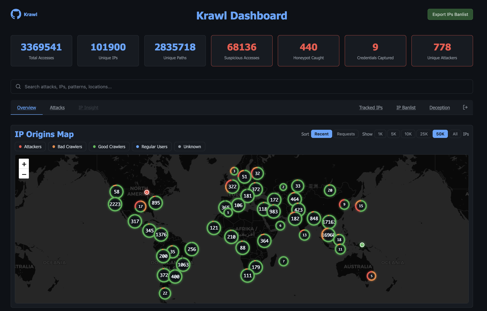
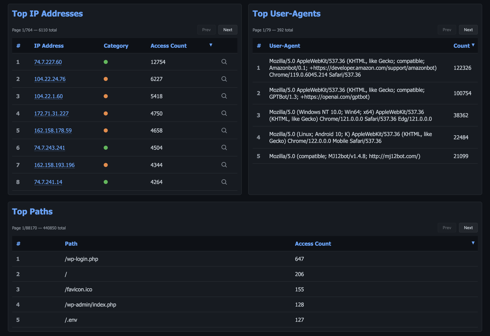
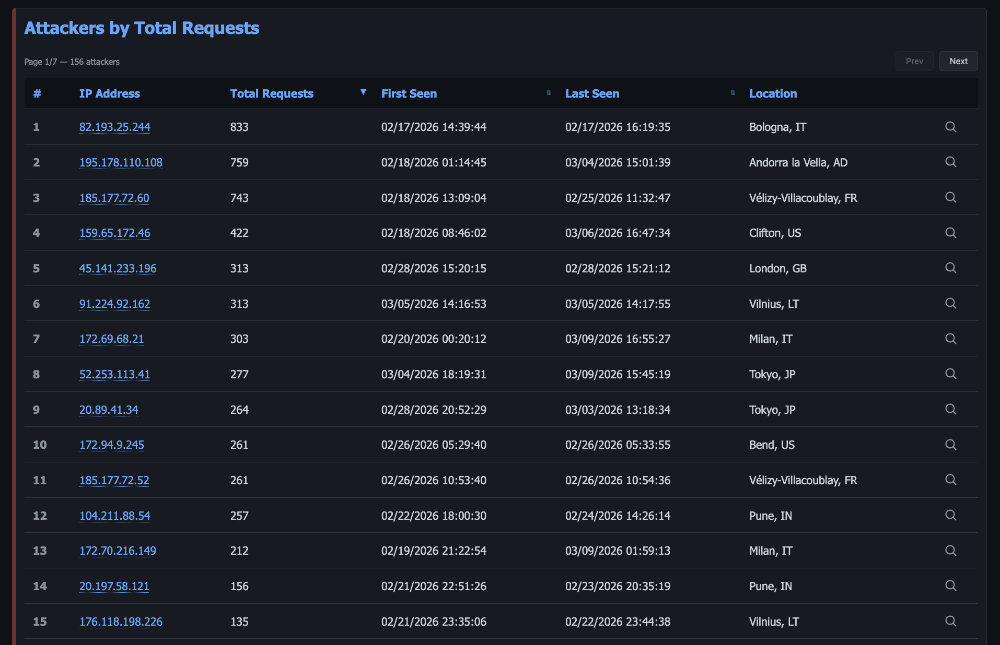
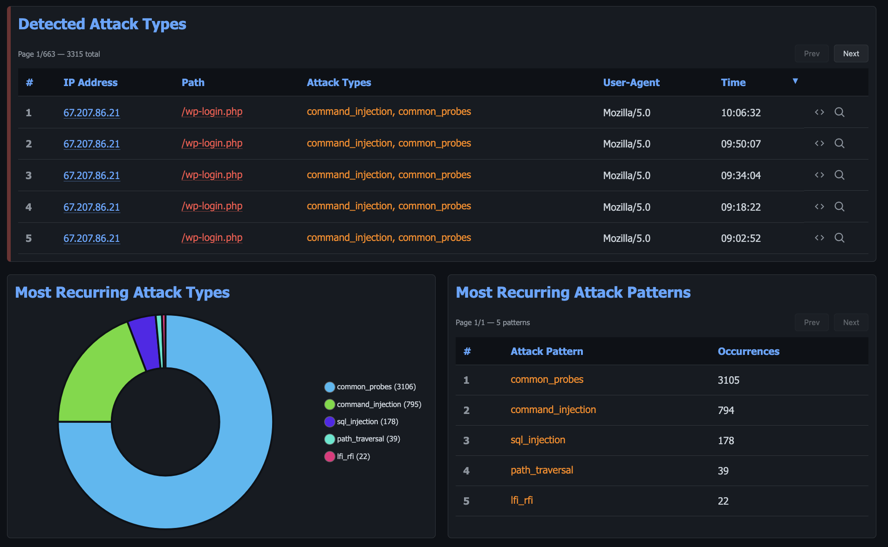
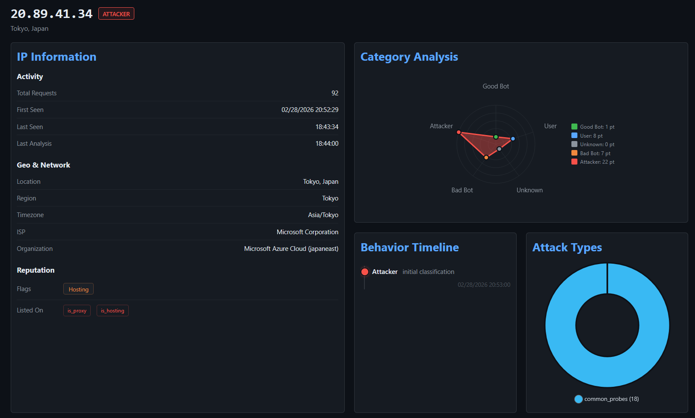
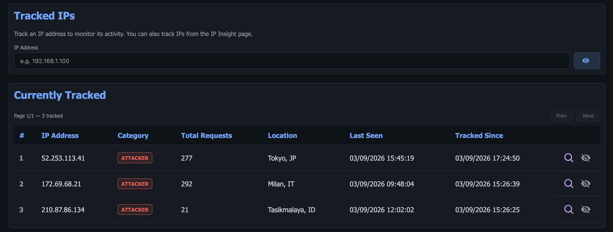
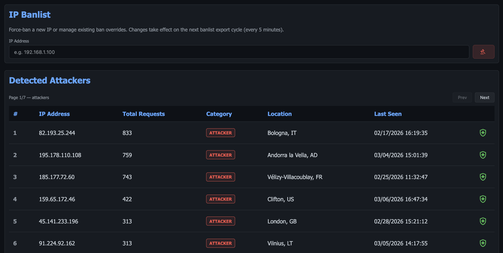
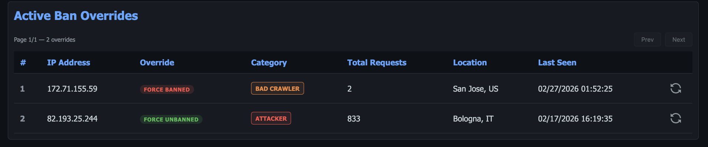
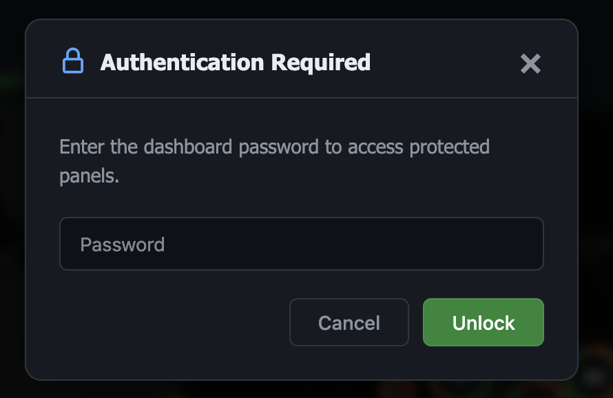

# Dashboard

Access the dashboard at `http://<server-ip>:<port>/<dashboard-path>`

The Krawl dashboard is a single-page application with **5 tabs**: Overview, Attacks, IP Insight, Tracked IPs, and IP Banlist. The last two tabs are only visible after authenticating with the dashboard password.

---

## Overview

The default landing page provides a high-level summary of all traffic and suspicious activity detected by Krawl.

### Stats Cards

Seven metric cards are displayed at the top:

- **Total Accesses** — total number of requests received
- **Unique IPs** — distinct IP addresses observed
- **Unique Paths** — distinct request paths
- **Suspicious Accesses** — requests flagged as suspicious
- **Honeypot Caught** — requests that hit honeypot endpoints
- **Credentials Captured** — login attempts captured by the honeypot
- **Unique Attackers** — distinct IPs classified as attackers

### Search

A real-time search bar lets you search across attacks, IPs, patterns, and locations. Results are loaded dynamically as you type.

### IP Origins Map

An interactive world map (powered by Leaflet) displays the geolocation of top IP addresses. You can filter by category:

- Attackers
- Bad Crawlers
- Good Crawlers
- Regular Users
- Unknown

The number of displayed IPs is configurable (top 10, 100, 1,000, or all).



### Recent Suspicious Activity

A table showing the last 10 suspicious requests with IP address, path, user-agent, and timestamp. Each entry provides actions to view the raw HTTP request or inspect the IP in detail.

### Top IP Addresses

A paginated, sortable table ranking IPs by access count. Each IP shows its category badge and can be clicked to expand inline details or open the IP Insight tab.

### Top Paths

A paginated table of the most accessed HTTP paths and their request counts.

### Top User-Agents

A paginated table of the most common user-agent strings with their frequency.



---

## Attacks

The Attacks tab focuses on detected malicious activity, attack patterns, and captured credentials.

### Attackers by Total Requests

A paginated table listing all detected attackers ranked by total requests. Columns include IP, total requests, first seen, last seen, and location. Sortable by multiple fields.



### Captured Credentials

A table of usernames and passwords captured from honeypot login forms, with timestamps. Useful for analyzing common credential stuffing patterns.

### Honeypot Triggers by IP

Shows which IPs accessed honeypot endpoints and how many times, sorted by trigger count.

### Detected Attack Types

A detailed table of individual attack detections showing IP, path, attack type classifications, user-agent, and timestamp. Each entry can be expanded to view the raw HTTP request.

### Most Recurring Attack Types

A Chart.js visualization showing the frequency distribution of detected attack categories (e.g., SQL injection, path traversal, XSS).

### Most Recurring Attack Patterns

A paginated table of specific attack patterns and their occurrence counts across all traffic.



---

## IP Insight

The IP Insight tab provides a deep-dive view for a single IP address. It is activated by clicking "Inspect IP" from any table in the dashboard.

### IP Information Card

Displays comprehensive details about the selected IP:

- **Activity** — total requests, first seen, last seen, last analysis timestamp
- **Geo & Network** — location, region, timezone, ISP, ASN, reverse DNS
- **Category** — classification badge (Attacker, Good Crawler, Bad Crawler, Regular User, Unknown)

### Ban & Track Actions

When authenticated, admin actions are available:

- **Ban/Unban** — immediately add or remove the IP from the banlist
- **Track/Untrack** — add the IP to your watchlist for ongoing monitoring

### Blocklist Memberships

Shows which threat intelligence blocklists the IP appears on, providing external reputation context.

### Access Logs

A filtered view of all requests made by this specific IP, with full request details.



---

## Tracked IPs

> Requires authentication with the dashboard password.

The Tracked IPs tab lets you maintain a watchlist of IP addresses you want to monitor over time.

### Track New IP

A form to add any IP address to your tracking list for ongoing observation.

### Currently Tracked IPs

A paginated table of all manually tracked IPs, with the option to untrack each one.



---

## IP Banlist

> Requires authentication with the dashboard password.

The IP Banlist tab provides tools for managing IP bans. Bans are exported every 5 minutes.

### Force Ban IP

A form to immediately ban any IP address by entering it manually.

### Detected Attackers

A paginated list of all IPs detected as attackers, with quick-ban actions for each entry.



### Active Ban Overrides

A table of currently active manual ban overrides, with options to unban or reset the override status for each IP.



### Export Banlist

A dropdown menu to download the current banlist in two formats:

- **Raw IPs List** — plain text, one IP per line
- **IPTables Rules** — ready-to-use firewall rules

---

## Authentication

The dashboard uses session-based authentication with secure HTTP-only cookies. Protected features (Tracked IPs, IP Banlist, ban/track actions) require entering the dashboard password. The login includes brute-force protection with IP-based rate limiting and exponential backoff.

Click the lock icon in the top-right corner of the navigation bar to authenticate or log out.



---

## Configuration

Dashboard behaviour is controlled under the `dashboard` section of `config.yaml` (or via environment variables).

### Secret path and password

```yaml
dashboard:
  secret_path: null       # auto-generated at startup if null
  password: null          # auto-generated at startup if null
```

| Env var | Description | Default |
|---|---|---|
| `KRAWL_DASHBOARD_SECRET_PATH` | Custom path for the dashboard | Auto-generated |
| `KRAWL_DASHBOARD_PASSWORD` | Password for protected dashboard panels | Auto-generated |

### Cache warmup

The dashboard pre-computes heavy queries in a background task every 5 minutes so that page loads are instant.

```yaml
dashboard:
  cache_warmup: true       # enable background warmup task
  warmup_pages: 10         # pages to pre-warm per table panel
  warmup_aggregation: false  # pre-compute full top_paths/top_ua aggregations
  top_n_min_count: 5       # minimum access count to appear in top paths/user-agents panels
```

| Env var | Description | Default |
|---|---|---|
| `KRAWL_DASHBOARD_CACHE_WARMUP` | Enable background warmup task | `true` |
| `KRAWL_DASHBOARD_WARMUP_PAGES` | Pages to pre-warm per table panel | `10` |
| `KRAWL_DASHBOARD_WARMUP_AGGREGATION` | Pre-compute full top_paths/top_ua aggregations for zero-query serving | `false` |
| `KRAWL_DASHBOARD_TOP_N_MIN_COUNT` | Minimum access count for top paths/user-agents (set to `1` to disable filtering) | `5` |

> **Scalable mode**: `warmup_aggregation` is enabled by default in Helm and Kubernetes deployments. In standalone mode it is disabled because SQLite handles the load without it.
