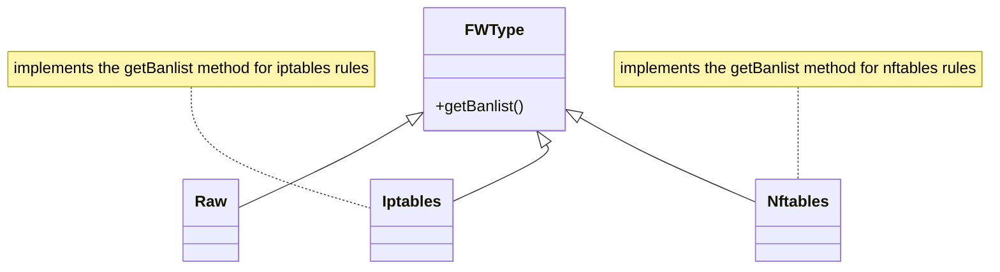

# Firewall Exporters

Krawl provides a real-time **Export API** to export IP lists for firewall integration.

## Export API

The `GET /api/export-ips` endpoint queries the database directly and returns a downloadable text file formatted for your firewall. This is the recommended approach for automated integrations (cron jobs, firewall scripts, etc.).

**Endpoint:** `<DASHBOARD-PATH>/api/export-ips`

**Parameters:**

| Parameter | Required | Description |
|-----------|----------|-------------|
| `categories` | Yes | Comma-separated list of IP categories to include |
| `fwtype` | No | Output format (default: `raw`) |

**Available categories:**

| Category | Description |
|----------|-------------|
| `attacker` | Malicious actors performing attacks (SQLi, XSS, path traversal, etc.) |
| `bad_crawler` | Non-compliant crawlers and bots violating robots.txt |
| `regular_user` | Normal human visitors |
| `good_crawler` | Legitimate web crawlers (Google, Bing, etc.) |

**Available formats (`fwtype`):**

| Format | Description | Output |
|--------|-------------|--------|
| `raw` | Plain text, one IP per line | `192.168.1.1\n192.168.1.2` |
| `iptables` | IPTables DROP rules | `iptables -A INPUT -s 192.168.1.1 -j DROP` |
| `nftables` | NFTables set-based rules | `nft add set inet filter blacklist { ... }` |

**Examples:**

```bash
# Export attacker IPs as a raw list
curl "https://your-krawl-instance/<DASHBOARD-PATH>/api/export-ips?categories=attacker&fwtype=raw"

# Export attackers + bad crawlers as iptables rules
curl "https://your-krawl-instance/<DASHBOARD-PATH>/api/export-ips?categories=attacker,bad_crawler&fwtype=iptables"

# Export all categories as nftables rules
curl "https://your-krawl-instance/<DASHBOARD-PATH>/api/export-ips?categories=attacker,bad_crawler,regular_user,good_crawler&fwtype=nftables"

# Save to file for cron-based updates
curl -o /etc/iptables/krawl-banlist.sh \
  "https://your-krawl-instance/<DASHBOARD-PATH>/api/export-ips?categories=attacker&fwtype=iptables"
```

**Notes:**
- This endpoint does not require authentication
- Private/local IPs (10.x, 172.16-31.x, 192.168.x) and the server's own IP are automatically excluded
- IPs force-banned by an admin (`ban_override=True`) are always included regardless of category
- IPs force-unbanned by an admin (`ban_override=False`) are always excluded

### Dashboard UI

The same functionality is available from the dashboard via the **Export IPs Banlist** button, which opens a modal where you can select categories and format before downloading.

## Architecture

The firewall export feature uses a strategy pattern with an abstract class and subclasses for each firewall system:



## Adding Firewall Exporters

To add a firewall exporter, create a new Python class in `src/firewall` that implements `FWType`:

```python
from typing_extensions import override
from firewall.fwtype import FWType

class Yourfirewall(FWType):

    @override
    def getBanlist(self, ips) -> str:
        """
        Generate firewall rules from a list of IP addresses.

        Args:
            ips: List of IP addresses to ban

        Returns:
            String containing firewall rules
        """
        if not ips:
            return ""
        # Add your implementation here
```

Then import it in `src/routes/api.py` (inside the `export_ips` handler):

```python
from firewall.yourfirewall import Yourfirewall
```

The class is automatically registered in the `FWType` factory via `__init_subclass__` and becomes available as a `fwtype` parameter in the Export API.
