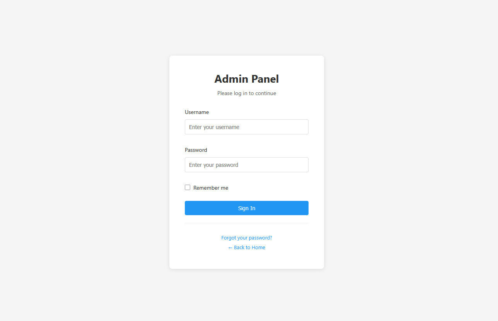
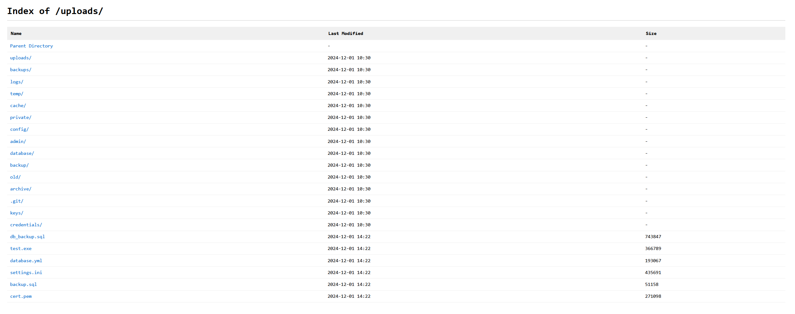
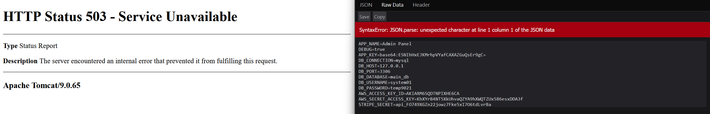
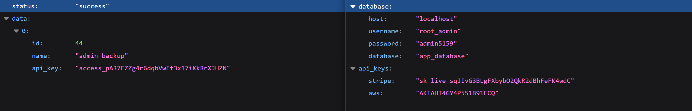
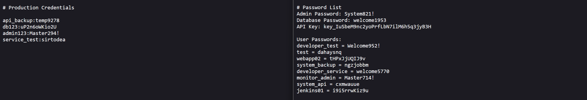
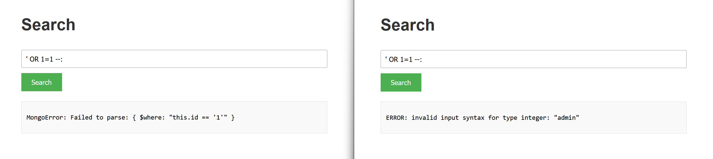

# Honeypot

Below is a complete overview of the Krawl honeypot's capabilities

## robots.txt
The actual (juicy) robots.txt configuration [is the following](../src/templates/html/robots.txt).

## Honeypot pages

### Common Login Attempts
Requests to common admin endpoints (`/admin/`, `/wp-admin/`, `/phpMyAdmin/`) return a fake login page. Any login attempt triggers a 1-second delay to simulate real processing and is fully logged in the dashboard (credentials, IP, headers, timing).

### Common Misconfiguration Paths
Requests to paths like `/backup/`, `/config/`, `/database/`, `/private/`, or `/uploads/` return a fake directory listing populated with "interesting" files, each assigned a random file size to look realistic.

### Environment File Leakage
The `.env` endpoint exposes fake database connection strings, **AWS API keys**, and **Stripe secrets**. It intentionally returns an error due to the `Content-Type` being `application/json` instead of plain text, mimicking a "juicy" misconfiguration that crawlers and scanners often flag as information leakage.

### Server Error Information
The `/server` page displays randomly generated fake error information for each known server.

### API Endpoints with Sensitive Data
The pages `/api/v1/users` and `/api/v2/secrets` show fake users and random secrets in JSON format

### Exposed Credential Files
The pages `/credentials.txt` and `/passwords.txt` show fake users and random secrets

### SQL Injection and XSS Detection
Pages such as `/users`, `/search`, `/contact`, `/info`, `/input`, and `/feedback`, along with APIs like `/api/sql` and `/api/database`, are designed to lure attackers into performing attacks such as **SQL injection** or **XSS**.

Automated tools like **SQLMap** will receive a different randomized database error on each request, increasing scan noise and confusing the attacker. All detected attacks are logged and displayed in the dashboard.

### Path Traversal Detection
Krawl detects and responds to **path traversal** attempts targeting common system files like `/etc/passwd`, `/etc/shadow`, or Windows system paths. When an attacker tries to access sensitive files using patterns like `../../../etc/passwd` or encoded variants (`%2e%2e/`, `%252e`), Krawl returns convincing fake file contents with realistic system users, UIDs, GIDs, and shell configurations. This wastes attacker time while logging the full attack pattern.

### XXE (XML External Entity) Injection
The `/api/xml` and `/api/parser` endpoints accept XML input and are designed to detect **XXE injection** attempts. When attackers try to exploit external entity declarations (`<!ENTITY`, `<!DOCTYPE`, `SYSTEM`) or reference entities to access local files, Krawl responds with realistic XML responses that appear to process the entities successfully. The honeypot returns fake file contents, simulated entity values (like `admin_credentials` or `database_connection`), or realistic error messages, making the attack appear successful while fully logging the payload.

### Command Injection Detection
Pages like `/api/exec`, `/api/run`, and `/api/system` simulate command execution endpoints vulnerable to **command injection**. When attackers attempt to inject shell commands using patterns like `; whoami`, `| cat /etc/passwd`, or backticks, Krawl responds with realistic command outputs. For example, `whoami` returns fake usernames like `www-data` or `nginx`, while `uname` returns fake Linux kernel versions. Network commands like `wget` or `curl` simulate downloads or return "command not found" errors, creating believable responses that delay and confuse automated exploitation tools.
